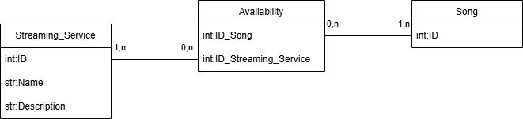

# GigSync

## USED TECHNOLOGIES
### Spring Boot
- **Java version**: 26
- **Spring Boot version**: 4.0.6

### Apache CXF

### Jakarta


## ARCHITECTURAL COMPONENTS
| ID | COMPONENT            | ROLE                  | TECHNOLOGY        | DESCRIPTION                                                                                           |
|----|----------------------|-----------------------|-------------------|-------------------------------------------------------------------------------------------------------|
| 1  | API Gateway          | **Gateway**           | Spring Cloud      | Acts as the single entry point for all client-to-service interactions. Built with Spring Cloud Gateway |
| 2  | Ticket Searcher      | **Prosumer**          | Spring (REST)     | It queries both ticket providers (4,5)                                                                |
| 3  | Artist Analyzer      | **Prosumer**          | Spring (REST)     | Fetches the artist's trending tracks and overall information (6,7)                                    |
| 4  | Legacy box office    | **Provider**          | Apache CXF (SOAP) | A service exposing a SOAP interface returning official prices                                         |
| 5  | Reseller             | **Provider**          | Jakarta (REST)    | A service returning secondary market prices                                                           |
| 6  | Music stats          | **Provider/Prosumer** | Spring (REST)     | A service returning all info about the artist and his songs                                           |
| 7  | Streaming Aviability | **Provider**          | Spring (REST)     | A service that returns if a song is aviable inside n streaming services                               |
| 8  | Load Balancer        | **Load Balancer**     | Spring Eureka     | Load balancer                                                                                         |


## ARCHITECTURE DIAGRAM


## DB DIAGRAM

> DB diagram for:
> - Music stats


---

> DB diagram for:
> - Legacy box office
> - Reseller


> DB diagram for:
> - Streaming Availability




### Legacy Box Office and Reseller

#### Event

| Column Name | Data Type |
| --- | --- |
| Event_Global_ID | int |
| Name | str |
| Artist Name | str |
| Location | str |
| Description | str |

#### Ticket

| Column Name | Data Type |
| --- | --- |
| ID | int |
| Price | float |
| Seat | str |
| Event_Global_ID | int |

> **Ticket ID:** unique for each event, so same ID can't be in reseller and legacy box office
 
> **Event_Global_ID:** unique, in different DBs the same event has the same ID.

> **Relationship Note:** `Event_Global_ID` in the **Ticket** table has a many-to-one relationship (`0,n` to `1,1`) with the `Event_Global_ID` column in the **Event** table.

---

### Music Stats

#### Artist

| Column Name | Data Type |
| --- | --- |
| ID | int |
| Name | str |
| Description | str |

#### Song

| Column Name | Data Type |
| --- | --- |
| ID | int |
| Name | str |
| Description | str |
| Views | int |
| ID_Artist | int |

> **Song ID:** unique, in different DBs the same song has the same ID. For example the Streaming and Music Stats DBs.

> **Relationship Note:** `ID_Artist` in the **Song** table has a many-to-one relationship (`0,n` to `1,1`) with the `ID` column in the **Artist** table. 

### Streaming Availability

#### Streaming_Service

| Column Name | Data Type |
| --- | --- |
| ID | int |
| Name | str |
| Description | str |

---

#### Availability

| Column Name | Data Type |
| --- | --- |
| ID_Song | int |
| ID_Streaming_Service | int |

---

#### Song

| Column Name | Data Type |
| --- | --- |
| ID | int |

> **Relationship Note:** The **Availability** table serves as a junction table to establish a many-to-many relationship between **Streaming_Service** and **Song**.
> * `ID_Streaming_Service` in the **Availability** table has a many-to-one relationship (`0,n` to `1,n`) with the `ID` column in the **Streaming_Service** table.
> * `ID_Song` in the **Availability** table has a many-to-one relationship (`0,n` to `1,n`) with the `ID` column in the **Song** table.

## ENDPOINTS

### 1: Gateway

>These are the endpoins visible by the user via the gateway

| ID | URL                                            | METHOD   | DESCRIPTION                                                                                                                                               |
|----|------------------------------------------------|----------|-----------------------------------------------------------------------------------------------------------------------------------------------------------|
| 1  | events/getEventByID/{Event_Global_ID}          | GET      | Get all infos of an event by its ID                                                                                                                       |
| 2  | events/getAllEvents                            | GET      | Get all aviable events                                                                                                                                    |
| 3  | events/searchByName/{Name}                     | GET      | Get all aviable events by the Name                                                                                                                        |
| 4  | ...                                            | ...      | every type of search we want to implement                                                                                                                 |
| 5  | events/getEventTickets/{Event_Global_ID}       | GET      | Get all aviable tickets by the Event ID                                                                                                                   |
| 6  | events/getTicket/{Event_Global_ID}/{Ticket_ID} | GET/POST? | Get Ticket info by his ID and the Event. **IF IS A POST WE HAVE TO SEND A JSON**                                                                          |
| 7  | stats/getArtist/{Artist_Name}                  | GET      | Search and get an Artist by his Name                                                                                                                      |
| 8  | stats/getSong/{Song_Name}                      | GET      | Search and get a Song by its Name                                                                                                                         |
| 9  | analyze/aviability/{Song_Name}                 | GET | Aggregate informations from two microservices and give the availability of a song inside streaming services  |
| 10 | analyze/getAllInfos/{Song_Name}                | GET | Aggregate informations from two microservices and give all available data                                  |
| 11 | analyze/getAllSongs/{Artist_Name}              | GET | Aggregate informations from two microservices and give all songs with aviable services    |

#### Json Outputs

> 1


```json
{
  "ID": 1,
  "Event_Global_ID": 12345,
  "Name": "Concert Name",
  "Artist Name": "Artist Name",
  "Location": "Venue Location",
  "Description": "Event Description"
}
```

---

> 2 


```json
[
  {
    "ID": 1,
    "Event_Global_ID": 12345,
    "Name": "Concert Name",
    "Artist Name": "Artist Name",
    "Location": "Venue Location",
    "Description": "Event Description"
  },
  {
    "ID": 2,
    "Event_Global_ID": 67890,
    "Name": "Another Concert",
    "Artist Name": "Another Artist",
    "Location": "Another Venue",
    "Description": "Another Event Description"
  }
]
```
---

> 3

```json
[
  {
    "ID": 1,
    "Event_Global_ID": 12345,
    "Name": "Concert Name",
    "Artist Name": "Artist Name",
    "Location": "Venue Location",
    "Description": "Event Description"
  },
  {
    ...
  }
  
]
```
---

> 5

```json
[
  {
    "ID": 1,
    "Price": 100.0,
    "Seat": "A1",
    "Event_ID": 12345
  },
  {
    "ID": 2,
    "Price": 150.0,
    "Seat": "A2",
    "Event_ID": 12345
  }
]
```
---

> 6

```json
{
  "ID": 1,
  "Price": 100.0,
  "Seat": "A1",
  "Event_ID": 12345
}
```
---

> 7

```json
{
  "ID": 1,
  "Name": "Artist Name",
  "Description": "Artist Description"
}
```
---

> 8

```json
{
  "ID": 1,
  "Name": "Song Name",
  "Description": "Song Description",
  "Views": 1000000,
  "ID_Artist": 1
}
```

> 9 

```json
{
  "ID": 1,
  "Song_Name": "Song Name",
  "Availability": [
    {
      "Streaming_Service": "Service A"
    },
    {
      "Streaming_Service": "Service B"
    }
  ]
}
```

---

> 10

```json
{
  "ID": 1,
  "Song_Name": "Song Name",
  "Song_Description": "Song Description",
  "Views": 1000000,
  "Artist_Name": "Artist Name",
  "Artist_Description": "Song Description",
  "Availability": [
    {
      "Streaming_Service": "Service A"
    },
    {
      "Streaming_Service": "Service B"
    }
  ]
}
```
---

> 11

```json
[
  {
    "ID": 1,
    "Song_Name": "Song Name",
    "Song_Description": "Song Description",
    "Views": 1000000,
    "Availability": [
      {
        "Streaming_Service": "Service A"
      },
      {
        "Streaming_Service": "Service B"
      }
    ]
  },
  {
    ...
  }
]
```

### 2: Ticket Searcher
| ID | URL                                     | METHOD    | DESCRIPTION                                                                                                                                  |
|----|-----------------------------------------|-----------|----------------------------------------------------------------------------------------------------------------------------------------------|
| 1  | getEventByID/{Event_Global_ID}          | GET       | Get all infos of an event directly from Legacy box office                                                                                    |
| 2  | getAllEvents                            | GET       | Get all aviable events directly from Legacy box office                                                                                       |
| 3  | searchByName/{Name}                     | GET       | Get all aviable events by the Name directly from Legacy box office                                                                           |
| 5  | getEventTickets/{Event_Global_ID}       | GET       | Get all aviable tickets by the Event ID by querying both Legacy box office and resellers                                                     |
| 6  | getTicket/{Event_Global_ID}/{Ticket_ID} | GET/POST? | Get Ticket info by his ID and the Event. Fetching it from either the Legacy box office or resellers  **IF IS A POST WE HAVE TO SEND A JSON** |

### 3: Artist Analyzer (/artist-analyzer/)
| ID | URL                    | METHOD | DESCRIPTION                          |
|----|------------------------|--------|--------------------------------------|
| 1  | artists                | GET    | Get all artists                      |
| 2  | songs                  | GET    | Get all songs                        |
| 3  | songs/{id}             | GET    | Get a song by its id                 |
| 4  | songs/by-name/{name}   | GET    | Get songs by name                    |
| 5  | songs/by-artist/{name} | GET    | Get songs by their artist's name     |
| 6  | streaming-services     | GET    | Get all available streaming services |
| 7  | artists/{id}           | GET    | Get artist by its id                 |


### 4: Legacy box office
| ID | URL                                            | METHOD    | DESCRIPTION                                                                      |
|----|------------------------------------------------|-----------|----------------------------------------------------------------------------------|
| 1  | getEventByID/{Event_Global_ID}          | GET       | Get all infos of an event by its ID                                              |
| 2  | getAllEvents                            | GET       | Get all aviable events                                                           |
| 3  | searchByName/{Name}                     | GET       | Get all aviable events by the Name                                               |
| 5  | getEventTickets/{Event_Global_ID}       | GET       | Get all aviable tickets by the Event ID                                          |
| 6  | getTicket/{Event_Global_ID}/{Ticket_ID} | GET/POST? | Get Ticket info by his ID and the Event. **IF IS A POST WE HAVE TO SEND A JSON** |

### 5: Reseller
| ID | URL                                            | METHOD    | DESCRIPTION                                                                      |
|----|------------------------------------------------|-----------|----------------------------------------------------------------------------------|
| 5  | getEventTickets/{Event_Global_ID}       | GET       | Get all aviable tickets by the Event ID                                          |
| 6  | getTicket/{Event_Global_ID}/{Ticket_ID} | GET/POST? | Get Ticket info by his ID and the Event. **IF IS A POST WE HAVE TO SEND A JSON** |

### 6: Music stats
| ID | URL                           | METHOD | DESCRIPTION                          |
|----|-------------------------------|--------|--------------------------------------|                                         
| 1  | songs                         | GET    | Get all songs                        |
| 2  | songs/by-name/{Song_Name}     | GET    | Search and get a Song by its Name    |
| 3  | songs/by-artist/{Artist_Name} | GET    | Search and get a Song by its Name    |
| 4  | artists                       | GET    | Get all artists                      |
| 5  | artists/{id}                  | GET    | Get an artist by their id            |
| 6  | artists/by-name/{Artist_Name} | GET    | Search and get an Artist by his Name |
| 7  | songs/{id}                    | GET    | get a song by its id                 |


### 7: Streaming Aviability (/streaming-availability/)
| ID | URL                                    | METHOD | DESCRIPTION                                                       |
|----|----------------------------------------|--------|-------------------------------------------------------------------|
| 1  | get-song-availability/{Song_ID}        | GET    | Gets streaming availability for all songs of the requested artist |
| 2  | get-all-songs-for-service/{Service_ID} | GET    | Get all songs aviable for a specific streaming service            |
| 3  | get-all-streaming-services             | GET    | Gets all streaming services aviable in the system                 |

## ASYNCHRONOUS COMMUNICATION
The asyncronus communication is implemented inside the **Ticket Provider** that has to call two different services (4,5) to get the price of the tickets and get the aviable events.


## INTERACTING SCENARIOS