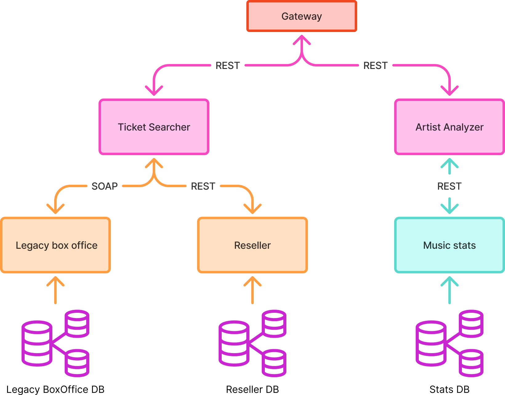
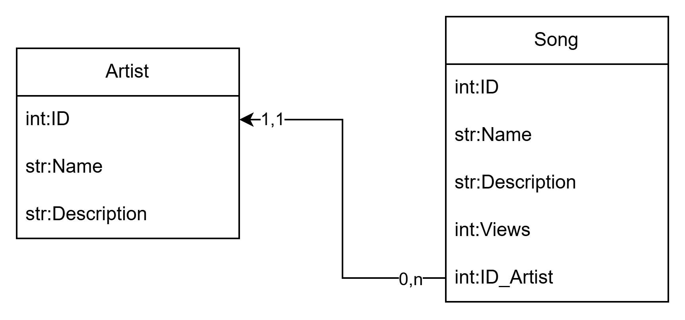
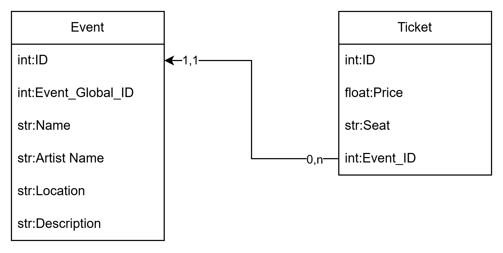

# GigSync

## USED TECHNOLOGIES
### Spring Boot
- **Java version**: 26
- **Spring Boot version**: 4.0.6

### Apache CXF

### Jakarta

## ARCHITECTURAL COMPONENTS
| ID | COMPONENT         | ROLE              | TECHNOLOGY        | DESCRIPTION                                                                                            |
|----|-------------------|-------------------|-------------------|--------------------------------------------------------------------------------------------------------|
| 1  | API Gateway       | **Gateway**       | Spring            | Acts as the single entry point for all client-to-service interactions. Built with Spring Cloud Gateway |
| 2  | Ticket Searcher   | **Prosumer**      | Spring (REST)     | It queries both ticket providers (4,5)                                                                 |
| 3  | Artist Analyzer   | **Prosumer**      | Spring (REST)     | Fetches the artist's trending tracks and overall information (6)                                       |
| 4  | Legacy box office | **Provider**      | Apache CXF (SOAP) | A service exposing a SOAP interface returning official prices                                          |
| 5  | Reseller          | **Provider**      | Jakarta (REST)    | A service returning secondary market prices                                                            |
| 6  | Music stats       | **Provider**      | Spring (REST)     | A service returning all info about the artist and his songs                                            |
| 7  | Load Balancer     | **Load Balancer** | Spring            | Load balancer                                                                                          |

## ARCHITECTURE DIAGRAM

## DB DIAGRAM

> DB diagram for:
> - Legacy box office
> - Legacy box office

---

> DB diagram for:
> - Music stats

Here are the database schemas from the image converted into Markdown tables, organized by their respective sections.

## Legacy Box Office and Reseller

### Event

| Column Name | Data Type |
| --- | --- |
| ID | int |
| Event_Global_ID | int |
| Name | str |
| Artist Name | str |
| Location | str |
| Description | str |

### Ticket

| Column Name | Data Type |
| --- | --- |
| ID | int |
| Price | float |
| Seat | str |
| Event_ID | int |

> **Relationship Note:** `Event_ID` in the **Ticket** table has a many-to-one relationship (`0,n` to `1,1`) with the `ID` column in the **Event** table.

---

## Music Stats

### Artist

| Column Name | Data Type |
| --- | --- |
| ID | int |
| Name | str |
| Description | str |

### Song

| Column Name | Data Type |
| --- | --- |
| ID | int |
| Name | str |
| Description | str |
| Views | int |
| ID_Artist | int |

> **Relationship Note:** `ID_Artist` in the **Song** table has a many-to-one relationship (`0,n` to `1,1`) with the `ID` column in the **Artist** table.

## ENDPOINTS
>These are the endpoins visible by the user via the gateway

| ID | URL                                            | METHOD    | DESCRIPTION                                                                      |
|----|------------------------------------------------|-----------|----------------------------------------------------------------------------------|
| 1  | events/getEventByID/{Event_Global_ID}          | GET       | Get all infos of an event by its ID                                              |
| 2  | events/getAllEvents                            | GET       | Get all aviable events                                                           |
| 3  | events/searchByName/{Name}                     | GET       | Get all aviable events by the Name                                               |
| 4  | ...                                            | ...       | every type of search we want to implement                                        |
| 5  | events/getEventTickets/{Event_Global_ID}       | GET       | Get all aviable tickets by the Event ID                                          |
| 5  | events/getTicket/{Event_Global_ID}/{Ticket_ID} | GET/POST? | Get Ticket info by his ID and the Event. **IF IS A POST WE HAVE TO SEND A JSON** |
| 6  | stats/getArtist/{Artist_Name]                  | GET       | Search and get an Artist by his Name                                             |
| 7  | stats/getSong/{Song_Name]                      | GET       | Search and get a Song by its Name                                                |
| 8  | ...                                            | ...       | Add other endpoints if we want                                                   |

## ASYNCHRONOUS COMMUNICATION
The asyncronus communication is implemented inside the **Ticket Provider** that has to call two different services (4,5) to get the price of the tickets and get the aviable events.

## INTERACTING SCENARIOS